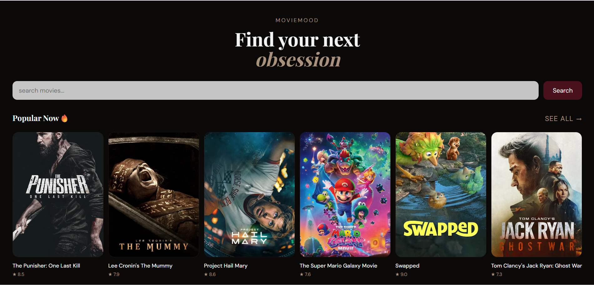
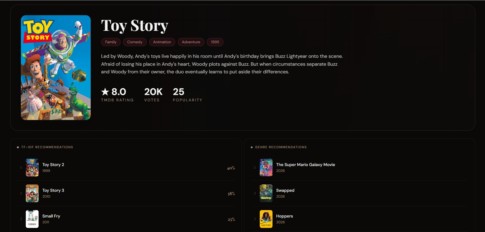

# 🎬 Movie Recommendation System

A full-stack web application that provides smart movie recommendations using **Machine Learning** and real-time movie data from the TMDB API.

The system combines:
- **Content-Based Filtering** using a local ML dataset
- **Genre-Based Recommendations** using TMDB APIs


## Live Demo

- **Frontend (Vercel):**  
  https://movie-recommendation-system-six-psi.vercel.app/

- **Backend API (Render):**  
  https://moviemood-backend-wh7o.onrender.com


## 📸 Screenshots

### Homepage


### Recommendations



## Features

### Hybrid Recommendation Engine

The application provides recommendations using two approaches:

### 1. Content-Based Filtering
- Uses **TF-IDF Vectorization**
- Computes **Cosine Similarity**
- Recommends movies based on textual similarity
- Uses locally trained ML model and dataset

### 2. Genre-Based Recommendations
- Uses TMDB Discover API
- Fetches movies with similar genres
- Provides dynamic real-time recommendations


### Asynchronous Backend
- Built using **FastAPI**
- Uses **HTTPX** for async API calls


### High Performance Frontend
- Built with **React 19 + Vite**
- Styled using **Tailwind CSS v4**


## 🛠️ Tech Stack

### Backend
- **Framework:** FastAPI
- **Language:** Python
- **ML Libraries:** Pandas, NumPy, Scikit-learn
- **Async Client:** HTTPX
- **Serialization:** Pickle


### Frontend
- **Framework:** React 19 (Vite)
- **Styling:** Tailwind CSS v4


## 📂 Project Structure

```plaintext
├── backend/
│   ├── main.py
│   ├── movie_recommendation.ipynb
│   ├── requirements.txt
│   ├── render.yaml
│   ├── runtime.txt
│   └── *.pkl
│
└── frontend/
    ├── package.json
    ├── vite.config.js
    ├── src/
    │   ├── services/
    │   │   └── api.js
    │   ├── components/
    │   ├── sections/
    │   ├── pages/
    │   ├── App.jsx
    │   └── main.jsx
```


## Prerequisites

Make sure the following are installed:

- Node.js (v18 or higher)
- Python (3.10 or higher)

Get API key from:  
https://www.themoviedb.org/


## API Documentation

### Fetch Movie Categories

```http
GET /home?category={category}&limit={limit}
```

### Query Parameters

| Parameter | Type   | Description             |
|-----------|--------|-------------------------|
| category  | string | popular, trending,      |
| limit     | integer| Number of movies (1-50) |

---

### Search & Recommendation Endpoint

```http
GET /movie/search?query={query}
```

### Description

This endpoint:
- Searches movie using TMDB
- Fetches movie details
- Generates TF-IDF recommendations
- Fetches genre-based similar movies
- Returns combined recommendation results


## 📌 Future Improvements

- User authentication
- Watchlist functionality
- Collaborative filtering
- AI-based personalized recommendations


## Developed using:
- FastAPI
- React
- Tailwind CSS
- Scikit-learn
- TMDB API
